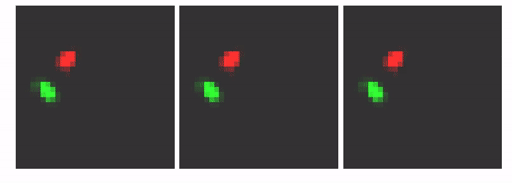

# MTDS for Double Pendulum

MTDS applied to video data of a double pendulum. This is code for the updated MTDS project -- for the previous version of the paper see [https://arxiv.org/abs/1910.05026](https://arxiv.org/abs/1910.05026). The details for the double pendulum work are only available in the updated paper which is currently under review. This repo is therefore not yet properly packaged up for an end user, although it will not take much extra work. For those who are interested, the code is fairly well annotated, and there's some commands to get you started below.

Our goal here is to show that by changing the architecture to an MTDS construct, we can permit customizable predictions from a seq2seq RNN (with convolutional encoder/decoder). An example is shown below. Here, the prediction for the first 10 frames is identical (shown with the lighter grey), after which we adjust the latent variable to yield three possible predictions.

<div style="text-align:center"></div>

For more examples, with some commentary, see [https://sites.google.com/view/mtds-customized-predictions/home](https://sites.google.com/view/mtds-customized-predictions/home).

# Example code usage
In this example, we load a pre-trained model (please download the data repository from [https://gin.g-node.org/alxbird/dblpendulum](https://gin.g-node.org/alxbird/dblpendulum) -- note
that the CLI appears not to work for downloading this file, at least if you're not logged into `gin`, so just download it directly from the webpage. Unpack the data into a folder called
`data` within the structure of this repo. (YAML files in `saved_models` will point here.)

### Imports / compile code
```julia
using Flux

# Load MTDS libraries
include("src/modelutils.jl")
include("src/datagen.jl")
include("src/seq2seq.jl")
include("src/multitask.jl")

const unsqueeze = modelutils.unsqueeze;  # trivial but useful function
const chan3cat = modelutils.chan3cat     # concatenate with (zero) 3rd colour channel
standardize(x; dims=1) = (x .- mean(x; dims=dims)) ./ std(x; dims=dims);
make_untracked(x) = mapleaves(Tracker.data, x)   # remove AD
```

### Generate data
```julia
data_xy, data_θ, data_meta = datagen.generate_data();   # _seed argument is fixed, but can be changed

# data_xy   - (x,y) co-ordinates of bob1 and bob2.
# data_θ    - (θ, θdot) state of bob1 and bob2 (for reference, but unused in model).
# data_meta - metadata about each sequence incl. ODE parameters and initial conditions.

# To reduce memory usage, we won't "image" all of these co-ordinates for the videos
# but instead construct these "on-demand". Julia can do this in microseconds.
constr_image(x) = (@assert length(x) == 4; datagen.gen_pic_circ2_2chan_cood_tf(x[1:2], x[3:4]))

tT = 80
cseq = [unsqueeze(constr_image(data_xy[:test][10][tt, :]), 4) for tt in 1:tT] # |> gpu # for loading to GPU.
```

### Load previously trained model
```julia
video_mtgru_pred_fixb_u = mtmodel.load_model_from_def("saved_models/mtgru_video_fixb_pred_300.yml")
video_mtgru_pred_fixb_u = make_untracked(video_mtgru_pred_fixb_u)  # |> gpu # for loading to GPU.

# Predict forward from the first T_enc values of the current sequence (`cseq`).
logit_yhat = video_mtgru_pred_fixb_u(cseq; T_enc=20, T_steps=80)
yhat = map(x->σ.(x), logit_yhat);    # perform (elementwise) sigmoid transform to list
```
